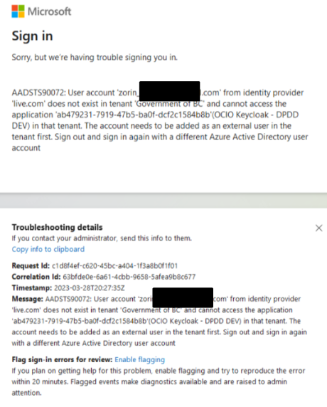
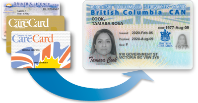

# Identity Providers

## Overview

The SSO service works with several identity provider (IDP) partners. An identity provider is the authoritative system where users authenticate and where their identity attributes originate.

For attribute-level details used in tokens and user mapping, see [Identity Mappers](../advanced/identity-mappers.md).

## Available Identity Providers

| Identity Provider | Typical Users | Notes |
| --- | --- | --- |
| **Azure IDIR** | BC Government employees and contractors | Recommended option for employee sign-in with MFA support. Learn more about [MFA registration](https://intranet.gov.bc.ca/thehub/ocio/ocio-enterprise-services/information-security-branch/information-security-mfa/mfa-registration). |
| **BCeID** | Residents and businesses accessing government services | Supports Basic and Business BCeID. Learn more about [BCeID Authentication Service](https://www2.gov.bc.ca/gov/content/governments/services-for-government/information-management-technology/identity-services-program/bceid-authentication-service). |
| **BC Services Card (BCSC)** | BC residents | Available through SSO with additional approval requirements. See [BC Services Card Login](https://www2.gov.bc.ca/gov/content/governments/government-id/bcservicescardapp). |
| **Digital Credential** | Verifiable credential users | Available for OIDC integrations. Learn more about [Digital Credentials](https://digital.gov.bc.ca/design/digital-trust/digital-credentials/). |
| **GitHub BC Gov** | Members of BC Government GitHub organizations | Production use may require policy or standards review. See [IM/IT Standards FAQs](https://www2.gov.bc.ca/gov/content/governments/services-for-government/policies-procedures/im-it-standards/faqs). |
| **OTP (One-Time Passcode)** | Email-based sign-in use cases | Users authenticate with a one-time passcode delivered by email. |

If you are deciding which IDP to use, these references may help:

- [BC Government ID Services](https://www2.gov.bc.ca/gov/content/governments/services-for-government/information-management-technology/id-services)
- [Identity providers comparison page](https://www2.gov.bc.ca/gov/content/governments/services-for-government/information-management-technology/id-services/compare-people)

## Azure IDIR (MFA) Notes

Azure IDIR includes multi-factor authentication and is more secure than legacy on-prem IDIR flows.

If a user's IDIR account is not tied to a `gov.bc.ca` email address, they may need to use the format `idir_username@gov.bc.ca` when prompted for email.

If users see an Azure IDIR sign-in error, confirm they have an active BC Government Azure IDIR account.

## Common Login Issues

### I can't login to both on-prem IDIR and BCeID in the same browser?

When using legacy on-prem IDIR (not Azure IDIR), browser session conflicts can occur if one tab is logged in with IDIR and another with BCeID.

Use an incognito/private browser window, or clear browser cache and cookies before testing.

### Other Issues

If the issue persists after private-mode testing, contact the SSO team in the [Microsoft Teams Keycloak How-to Channel](https://teams.microsoft.com/l/channel/19%3A35d0b3389e39479590ba45a19a67a3ba%40thread.tacv2/SSOKeycloak-howto?groupId=a80418da-c27b-406e-89ab-7695b61924d8&tenantId=6fdb5200-3d0d-4a8a-b036-d3685e359adc).

## Digital Credential Configuration

Digital Credential integration defines which credential (or credential combination) is requested during authentication.

Work with the [DITP team](mailto:ditp.support@gov.bc.ca) to confirm whether an existing configuration can be reused or whether a new configuration is required for your use case.

For implementation guidance, see [vc-authn-oidc best practices](https://github.com/bcgov/vc-authn-oidc/blob/main/docs/BestPractices.md).

## BC Services Card Integration

BC Services Card provides an OIDC authentication service and is available in production. Because of the sensitivity of BCSC identity data, integrations require approval from the IDIM team before BCSC can be enabled as a login option.

### Options for Teams with BCSC Requirements

#### 1. Integrate with Standard Service (Recommended)

Most teams should request BCSC through the [Standard service](./introduction.md#standard-service) using the [CSS](https://sso-requests.apps.gold.devops.gov.bc.ca/).

If your ministry or sector is not listed, contact IDIM Consulting to discuss onboarding.

#### 2. Join an Existing Custom Realm

With IDIM approval, some teams can join an existing custom realm that already has BCSC enabled and shares the same security context (typically within the same ministry or sector).

This is less common, but can be appropriate for closely related programs with compatible privacy and identity requirements.

#### 3. Run a Dedicated Keycloak Deployment

For rare cases requiring full ownership of authentication infrastructure, teams can run their own Keycloak deployment and configure a direct OIDC integration with BCSC.

This option has the highest operational overhead and should be considered only when Standard or existing Custom Realm options cannot meet requirements.

## Need Help?

Questions about IDP selection or integration setup:

- Teams: [Keycloak How-to Channel](https://teams.microsoft.com/l/channel/19%3A35d0b3389e39479590ba45a19a67a3ba%40thread.tacv2/SSOKeycloak-howto?groupId=a80418da-c27b-406e-89ab-7695b61924d8&tenantId=6fdb5200-3d0d-4a8a-b036-d3685e359adc)
- Email: [SSO Team](mailto:bcgov.sso@gov.bc.ca)