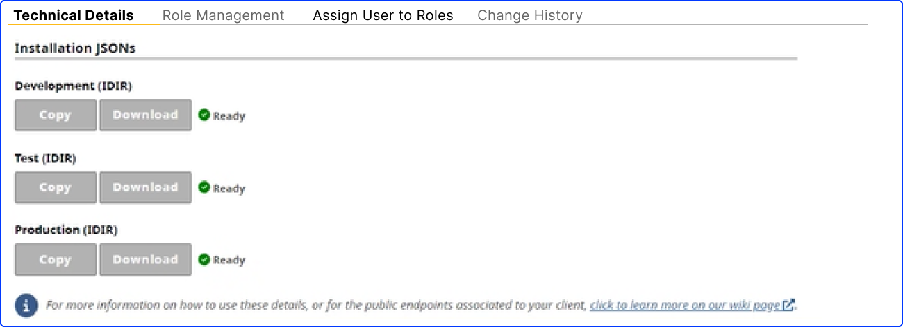

# Using your installation JSON file

---

Once your [request has been completed](https://bcgov.github.io/sso-request), you will be able to download your installation file for each environment. It includes the client information to set up your SSO configuration.



## Understanding the installation JSON

This file includes the client information to set up your SSO configuration.

The main difference between `confidential` and `public` clients is that confidential clients require client secret. Learn more on [client types](client-types)

An example installation JSON for `public` client type

```json
{
  "realm": "<standard_realm_name>",
  "auth-server-url": "https://<env>.loginproxy.gov.bc.ca/auth/",
  "ssl-required": "external",
  "resource": "<client_id>",
  "public-client": true,
  "verify-token-audience": true,
  "use-resource-role-mappings": true,
  "confidential-port": 0
}
```

An example installation JSON for `confidential` client type

```json
{
  "realm": "<standard_realm_name>",
  "auth-server-url": "https://<env>.loginproxy.gov.bc.ca/auth/",
  "ssl-required": "external",
  "resource": "<client_id>",
  "credentials": {
    "secret": "<client_secret>"
  },
  "confidential-port": 0
}
```
