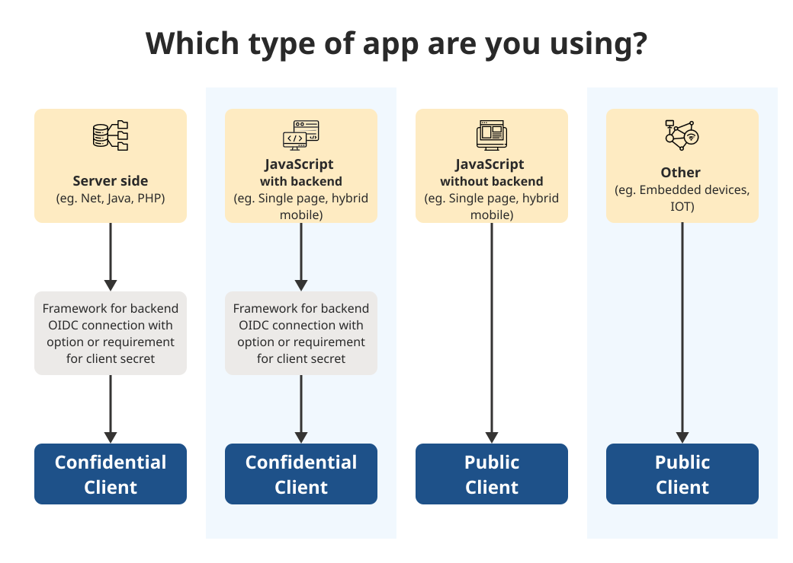

# Client types

--- Learn about various client types to choose from based on the security needs of your app.

### Client type confidential vs public

In the [CSS App](https://sso-requests.apps.gold.devops.gov.bc.ca/), when requesting a new client you can specify to set it up in two ways:

1. _Confidential client_
2. _Public Client_ with PKCE.

### 1. Confidential client:

With a confidential client, the back-end component securely stores an application secret that allows it to communicate with the KeyCloak server to facilitate the OIDC authentication process.

### 2. Public client with PKCE:

A public client is slightly less secure because there is no secret, but this configuration is required by some architectures and is supported as well. [Public clients can use PKCE (Proof Key for Code Exchange) as a more secure flow.](client-types#proof-key-for-code-exchange-pkce)

### Proof Key for Code Exchange (PKCE)

The javascript adapter for keycloak has built-in support for using PKCE. See the documentation under the init method here, specifically the `pkceMethod`.
For example, when initializing the adapter you can call `keycloak.init({ pkceMethod: 'S256' })` to use PKCE. Use the 'S256' method for you public client.

If not using the adapter, you can use a custom implementation. This will require 4 steps:

1. Create a `code_verifier` (cryptographically secure string)
2. Hash the code verifier with the SHA256 method to create a `code_challenge`
3. Send the code challenge and code challenge method (S256) as query parameters when redirecting users to the authorization endpoint.
4. When exchanging the received code for an access token, send the initial `code_verifier` to ensure your application initiated the current exchange.
   For an example of a custom PKCE implementation, see here for generating the authentication URL and [here](https://github.com/bcgov/sso-requests/blob/dev/app/utils/openid.ts) for exchanging the received code for an access token.

### Why choose PKCE over Implicit flow:

PKCE provides dynamic client secrets, meaning your app’s client secrets can stay secret (even without a back end for your app). PKCE is better and more secure than the implicit flow (AKA the “token flow”).
If you’re using the implicit flow, then you should switch to PKCE. If you use an implicit flow to authorize your Dropbox app, then PKCE is a better, more secure replacement, and you should no longer use implicit flow.
See the diagram below for use cases where each option is appropriate.

### Diagram

Learn More [OIDC & PKCE](https://auth0.com/docs/get-started/authentication-and-authorization-flow/authorization-code-flow-with-proof-key-for-code-exchange-pkce)
