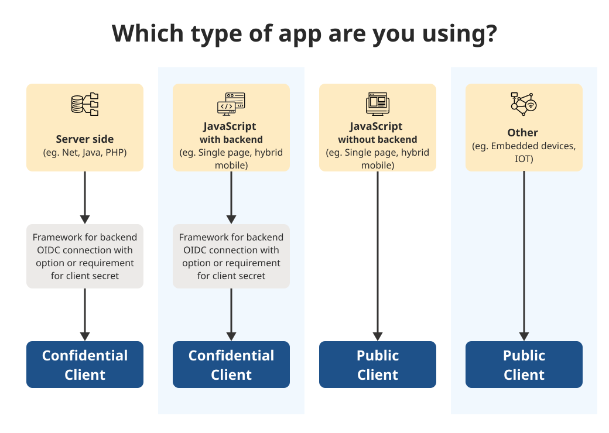

### Client Type: Confidential vs. Public

When requesting a new client in the [CSS App](https://sso-requests.apps.gold.devops.gov.bc.ca/), you can choose from two supported client types:

1. _Confidential client_
2. _Public Client_ with PKCE.

### 1. Confidential Client:

With a confidential client, the back-end component securely stores an application secret that allows it to communicate with the KeyCloak server to facilitate the OIDC authentication process.

### 2. Public Client with PKCE:

A public client does not use a client secret and is therefore inherently less secure than a confidential client. However, this configuration is required for certain application architectures (such as single‑page applications or native mobile apps) and is fully supported.

Public clients can use **PKCE (Proof Key for Code Exchange)** to mitigate the risks associated with the absence of a client secret.  


### Proof Key for Code Exchange (PKCE)


The Keycloak JavaScript adapter includes built‑in support for PKCE. When using the adapter, enable PKCE during initialization by setting the `pkceMethod` option.

Example:
```js
keycloak.init({ pkceMethod: 'S256' });
```


If you are not using the Keycloak adapter, you may implement PKCE manually. A custom PKCE flow requires the following steps:

1. Create a `code_verifier` (cryptographically secure string)
2. Hash the code_verifier with the SHA-256 method to create a `code_challenge`
3. Send the code_challenge and code challenge method (S256) as query parameters when redirecting users to the authorization endpoint.
4. When exchanging the received code for an access token, send the initial `code_verifier` to prove that your application initiated the flow.

For a detailed implementation walkthrough, see this [example](https://auth0.com/docs/get-started/authentication-and-authorization-flow/authorization-code-flow-with-pkce/add-login-using-the-authorization-code-flow-with-pkce).


### Why Choose PKCE Over the Implicit Flow:

PKCE provides dynamic protection comparable to a client secret, even for applications without a secure back end. It is significantly more secure than the Implicit Flow (also known as the “token flow”), which exposes tokens directly to the browser.
If your application currently uses the Implicit Flow, you should migrate to Authorization Code Flow with PKCE. The Implicit Flow is no longer recommended and should not be used for new integrations.

See the diagram below for use cases where each option is appropriate.

### Diagram



Learn More [OIDC & PKCE](https://auth0.com/docs/get-started/authentication-and-authorization-flow/authorization-code-flow-with-proof-key-for-code-exchange-pkce)
