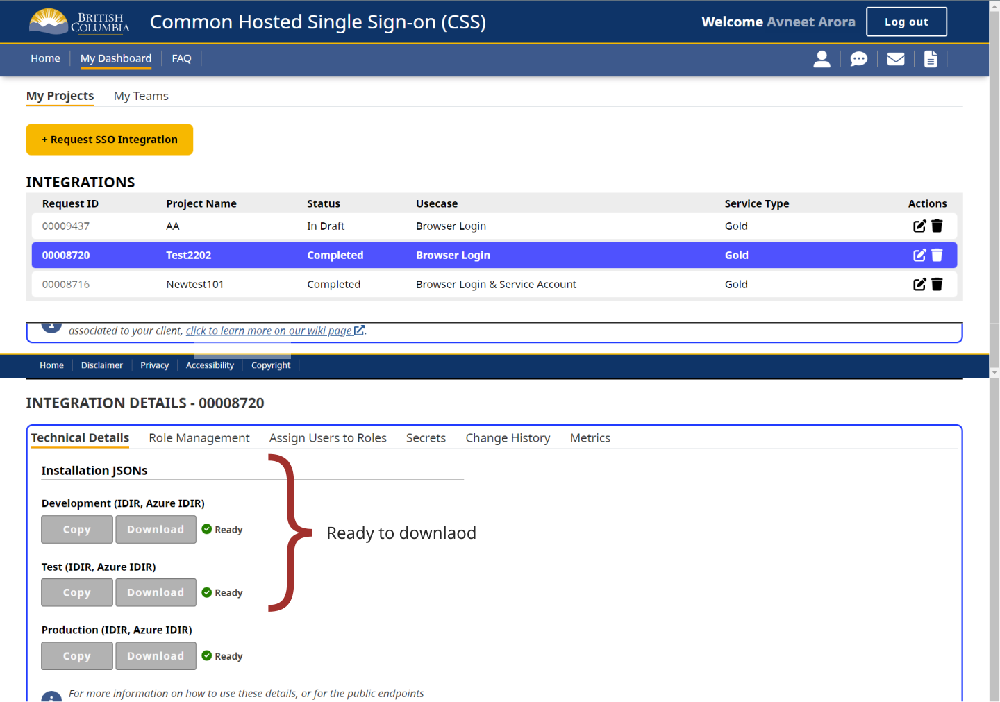

Once your integration in [CSS App](https://sso-requests.apps.gold.devops.gov.bc.ca/) has been approved and completed, you’ll be able to download an installation file for each environment (DEV, TEST, and PROD). These files contain the client configuration details required to integrate your application with Pathfinder SSO.



## Understanding the installation JSON

The installation JSON includes all client‑specific information needed to configure your SSO integration.

One key distinction in the configuration is the client type:
- **Confidential clients** require a client secret, which must be stored securely on a back end.
- **Public clients** do not use a client secret and must instead rely on PKCE for security.

For more details, see [client types](client-types).

Below is an example of an installation JSON for a `public` client.

```json
{
  "realm": "<standard_realm_name>",
  "auth-server-url": "https://<env>.loginproxy.gov.bc.ca/auth/",
  "ssl-required": "external",
  "resource": "<client_id>",
  "public-client": true,
  "verify-token-audience": true,
  "use-resource-role-mappings": true,
  "confidential-port": 0
}
```

Below is an example of an installation JSON for a `confidential` client.

```json
{
  "realm": "<standard_realm_name>",
  "auth-server-url": "https://<env>.loginproxy.gov.bc.ca/auth/",
  "ssl-required": "external",
  "resource": "<client_id>",
  "credentials": {
    "secret": "<client_secret>"
  },
  "confidential-port": 0
}
```
