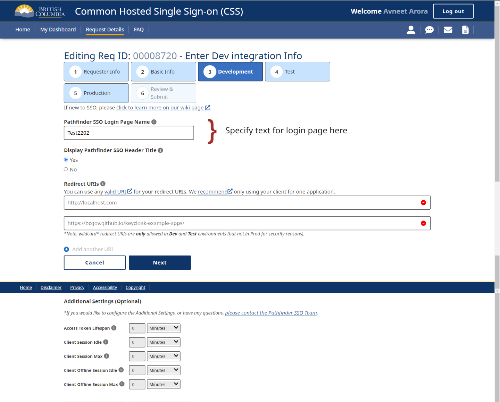

# Login Page Guide

--- Learn how to configure your login page.

### Skipping the standard login page

Recommend Skipping the Standard Login Page and if you ABSOLUTELY need it, then as you've read in [do's and don'ts](../best-practices/dos-donts#do-skip-the-standard-login-page), our recommendation is to skip the keycloak login page.

**If you need it, please specify dedicated text for login page**

[Through our CSS App](https://sso-requests.apps.gold.devops.gov.bc.ca/), you can specify the text under the field setting Keycloak Login Page Name

### Specifying an identity provider (IDP) to bypass the standard login page

If there is more than one IDP in the realm, the Keycloak server directs your users into a login page to let them choose the IDP that they want to authenticate with. It is possible to skip the login page or override the default IDP in Keycloak by passing the optional query param" kc_idp_hint". [List of kc_idp_hints here](../best-practices/dos-donts#do-skip-the-standard-login-page)

If using an adapter, there is an option for providing `idpHint`, and
if not, please specify it in the `Authorization URL` in your code or configuration, i.e.`http://localhost:8080/auth?kc_idp_hint=<idp_name>`
Please see [here](https://www.keycloak.org/docs/latest/server_admin/index.html#_client_suggested_idp) for more detail.

If the framework you are using prevents you from being able to pass through the _IDP hint_, please reach out to our team through rocket chat or email to ask about alternative options.
