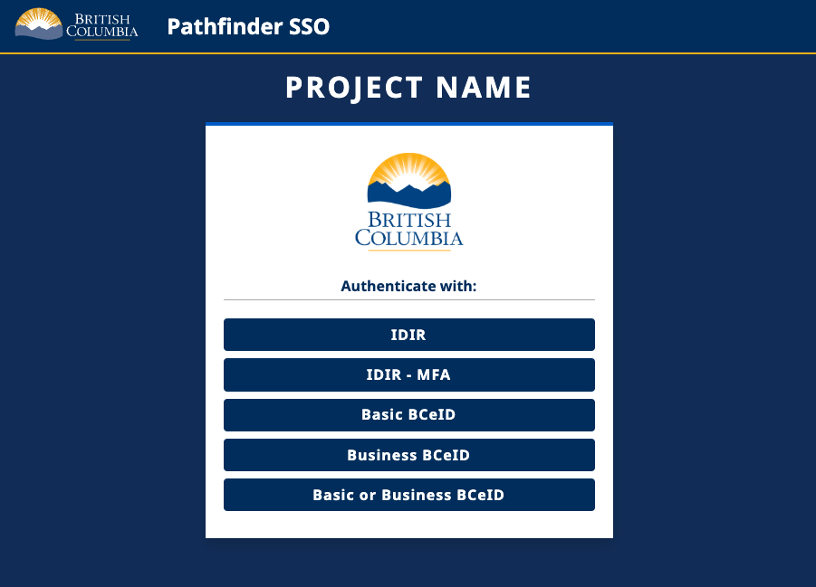
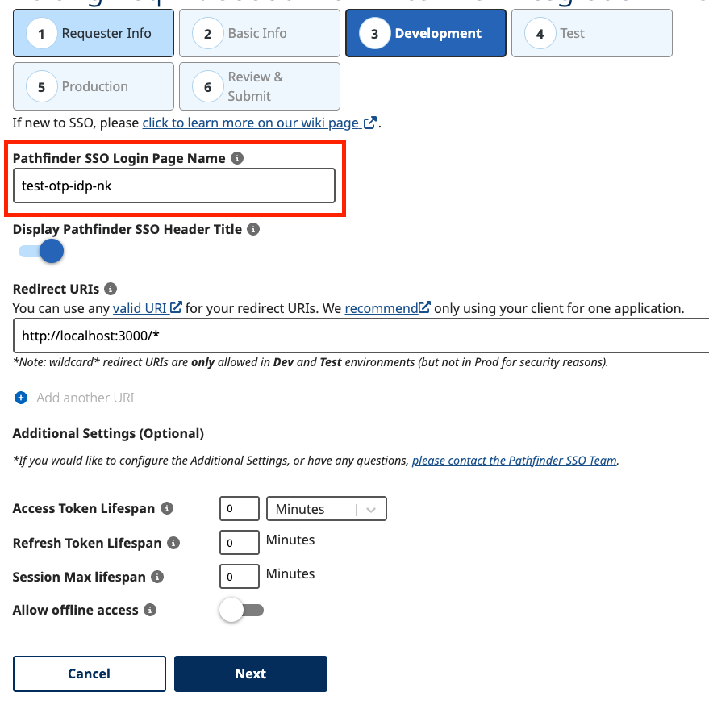

# Customizing Login Page

Once your integration request has been processed and your application is connected to its Keycloak client, the login experience your users see will depend on how many identity providers (IDPs) are configured for your integration:

1. **Single IDP**: Users are redirected directly to that IDP's login page, bypassing the Keycloak login screen entirely.
2. **Multiple IDPs (without `kc_idp_hint`)**: Users are redirected to Keycloak's default login page, where they can select which IDP to authenticate with.

## Default Login Page

The default login page looks as shown below. The page will show the project name that you entered when requesting an integration via [CSS](https://sso-requests.apps.gold.devops.gov.bc.ca/). It also shows logins buttons and each login button corresponds to an IDP.

### Customizing the Login Page

If your implementation requires the Keycloak login page, you must provide **dedicated, clear, and user‑appropriate text** for the page.

Using the [CSS](https://sso-requests.apps.gold.devops.gov.bc.ca/), you can specify this text by setting the **Pathfinder SSO Login Page Name** field during integration configuration.

## Skipping the Default Login Page

We strongly recommend **skipping the default Keycloak login page** wherever possible. Bypassing it provides a smoother user experience by taking users directly to their IDP without an intermediate selection step. See the [do's and don'ts](../best-practices/dos-donts#do-skip-the-standard-login-page) for further guidance. Only display the default login page if your use case genuinely requires users to choose from multiple IDPs at runtime.

### How to Skip Default Login Page?

When a Keycloak client is configured with multiple IDPs, users are shown the default login page to select their IDP. You can skip this step entirely by passing the `kc_idp_hint` query parameter in your authorization request, which routes the user directly to the specified IDP. See the full list of [supported `kc_idp_hint` values](../best-practices/dos-donts#do-skip-the-standard-login-page).

- **If using an adapter**: supply the `idpHint` option during initialization.
- **If not using an adapter**: include `kc_idp_hint` in your authorization request URL, for example `http://localhost:8080/auth?kc_idp_hint=<idp_name>`

Please see [Keycloak documentation](https://www.keycloak.org/docs/latest/server_admin/index.html#_client_suggested_idp) for additional details.

### Need Help Passing an IDP Hint?

If the framework you are using prevents you from being able to pass through the _IDP hint_, please [contact SSO](../index.md#support-and-contact) team.
