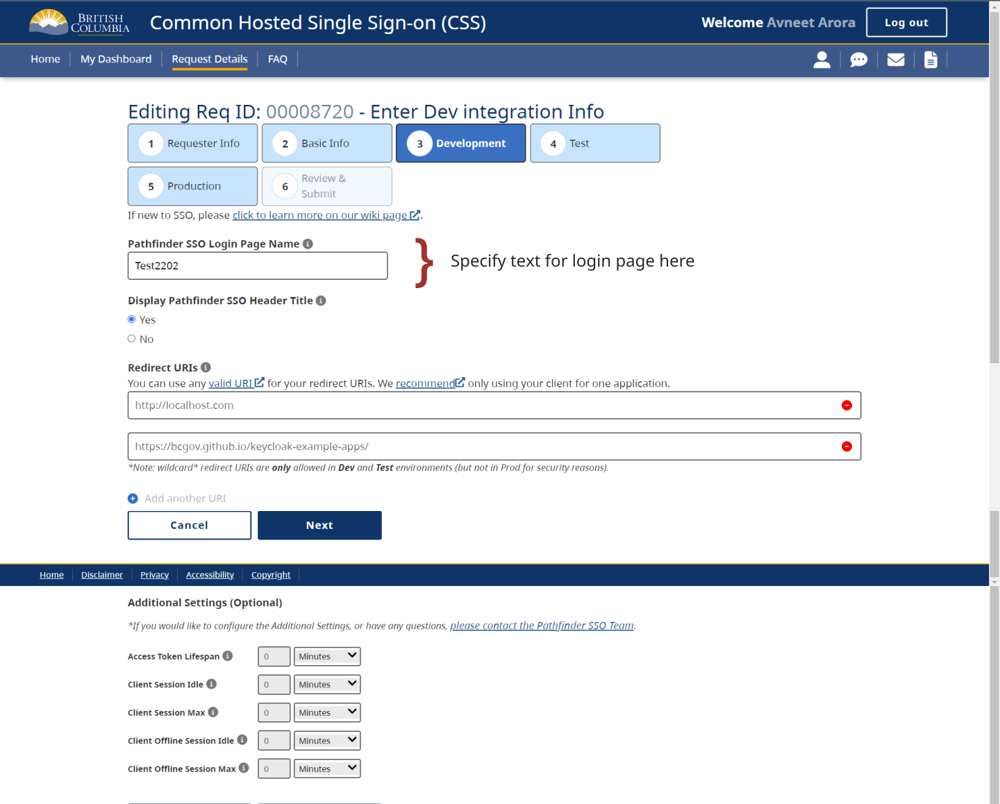

### Skipping the Standard Login Page

We strongly recommend **skipping the standard Keycloak login page** whenever possible. As outlined in the [do's and don'ts](../best-practices/dos-donts#do-skip-the-standard-login-page), bypassing the default login page provides a better user experience and reduces unnecessary friction.

Only use the standard login page if it is absolutely required by your use case.

**Customizing the Login page (if required)**

If your implementation requires the Keycloak login page, you must provide **dedicated, clear, and user‑appropriate text** for the page.

Using the [CSS App](https://sso-requests.apps.gold.devops.gov.bc.ca/), you can specify this text by setting the **Pathfinder SSO Login Page Name** field during integration configuration.

### Specifying an Identity Provider (IDP) to Bypass the Standard Login Page

When multiple identity providers (IDPs) are available in a realm, Keycloak displays a login page prompting the user to select an IDP. You can bypass this page and route users directly to a specific IDP by passing the optional query parameter `kc_idp_hint`. 

[List of kc_idp_hints here](../best-practices/dos-donts#do-skip-the-standard-login-page)

- **If using an adapter**: supply the `idpHint` option during initialization.
- **If not using an adapter**: include `kc_idp_hint` in your authorization request URL, for example `http://localhost:8080/auth?kc_idp_hint=<idp_name>`

Please see [Keycloak documentation](https://www.keycloak.org/docs/latest/server_admin/index.html#_client_suggested_idp) for additional details.

### Need Help Passing an IDP Hint?
If the framework you are using prevents you from being able to pass through the _IDP hint_, please reach out to our team through [Microsoft Teams Keycloak How-to Channel](https://teams.microsoft.com/l/channel/19%3A35d0b3389e39479590ba45a19a67a3ba%40thread.tacv2/SSOKeycloak-howto?groupId=a80418da-c27b-406e-89ab-7695b61924d8&tenantId=6fdb5200-3d0d-4a8a-b036-d3685e359adc) or by [email](mailto:bcgov.sso@gov.bc.ca) to discuss alternative options.
